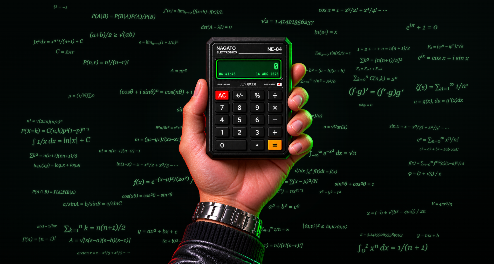
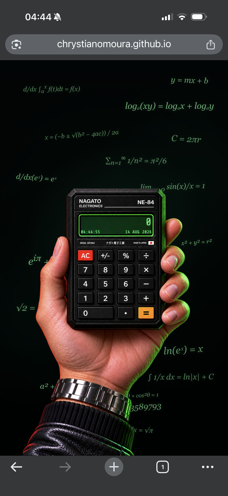

# NAGATO ELECTRONICS — NE-84

> Calculadora retrô interativa inspirada na estética tecnológica japonesa dos anos 1980, desenvolvida com HTML, CSS e JavaScript puro.

<p align="center">
  <a href="https://chrystianomoura.github.io/nagato-electronics-ne84/">
    <strong>🌐 Acessar aplicação</strong>
  </a>
</p>



---

## Sobre o projeto

A **NE-84** é uma calculadora retrô interativa inspirada na estética tecnológica japonesa dos anos 1980.

O projeto combina uma interface construída sobre uma arte visual própria, visor digital funcional, suporte a mouse, toque e teclado, relógio em tempo real e um background matemático distribuído dinamicamente.

Além de funcionar como projeto de portfólio, seu código foi organizado por responsabilidades e comentado para também servir como material de estudo de **HTML, CSS e JavaScript**.

A implementação utiliza tecnologias nativas da plataforma web, sem frameworks ou bibliotecas JavaScript externas.

---

## Projeto online

A versão estável está publicada através do GitHub Pages:

**Live Demo:**  
https://chrystianomoura.github.io/nagato-electronics-ne84/

---

## Funcionalidades

- Operações de soma, subtração, multiplicação e divisão.
- Porcentagem com comportamento contextual.
- Alteração de sinal (`+/-`).
- Suporte a números decimais.
- Tratamento de divisão por zero com `ERROR`.
- Repetição da última operação ao pressionar `=` novamente.
- Limite de 11 dígitos no visor.
- Notação científica para resultados que ultrapassam o espaço disponível.
- Relógio e data em tempo real.
- Controle por clique, toque e teclado físico.
- Suporte ao teclado numérico (`Numpad`).
- Background com 100 fórmulas matemáticas.
- Distribuição responsiva das fórmulas com prevenção de colisões.
- Parallax suave no background.
- Respeito à preferência `prefers-reduced-motion`.
- Testes automatizados da lógica da calculadora.

---

## Tecnologias utilizadas

### Front-end

- **HTML5**
- **CSS3**
- **JavaScript**

### Desenvolvimento e testes

- **Node.js** — utilizado para executar os testes automatizados.
- **node:test** — test runner nativo do Node.js.
- **Git**
- **GitHub**
- **GitHub Pages**

O projeto não utiliza frameworks ou bibliotecas JavaScript externas.

---

## Estrutura do projeto

```text
nagato-electronics-ne84/
├── estilos/
│   └── style.css
│
├── imagens/
│   ├── screenshots/
│   │   ├── ne84-desktop.png
│   │   └── ne84-mobile.png
│   │
│   ├── apple-touch-icon.png
│   ├── favicon-16x16.png
│   ├── favicon-32x32.png
│   ├── favicon-512x512.png
│   ├── favicon.ico
│   └── ne84-calculator.png
│
├── scripts/
│   ├── calculator.js
│   ├── clock.js
│   ├── background.js
│   └── main.js
│
├── tests/
│   └── calculator.test.js
│
├── .gitignore
├── LICENSE
├── index.html
├── package.json
└── README.md
```

---

## Arquitetura

A aplicação divide suas principais responsabilidades entre quatro módulos:

```text
calculator.js  → lógica e interface da calculadora
clock.js       → relógio e data
background.js  → fórmulas matemáticas e parallax
main.js        → inicialização da aplicação
```

A lógica principal da calculadora permanece isolada da interface através do `CalculatorEngine`.

Essa separação facilita:

- testes automatizados;
- manutenção;
- leitura do código;
- identificação de responsabilidades;
- evolução futura do projeto.

### `index.html`

Define a estrutura principal da aplicação, incluindo a cena, as expressões matemáticas do background, o visor digital e as áreas interativas posicionadas sobre as teclas presentes na imagem da calculadora.

Também utiliza elementos HTML apropriados e atributos de acessibilidade para fornecer significado adicional aos controles da interface.

### `style.css`

Controla toda a apresentação visual da NE-84, incluindo:

- cenário e background;
- posicionamento da calculadora;
- visor digital;
- áreas interativas das teclas;
- estados visuais de interação;
- animações;
- responsividade;
- redução de movimento.

Grande parte do posicionamento utiliza valores proporcionais para manter os elementos alinhados à imagem da calculadora em diferentes tamanhos de tela.

### `calculator.js`

Responsável pela lógica matemática e pelas interações da calculadora.

É dividido em duas partes principais:

1. **`CalculatorEngine`** — motor independente do DOM responsável por armazenar o estado e executar as operações da calculadora.
2. **`initCalculator()`** — camada de interface responsável por conectar o motor ao HTML, aos cliques, ao teclado físico e aos efeitos de interação.

Essa separação permite testar a lógica da calculadora diretamente no Node.js, sem depender do navegador ou da interface gráfica.

### `clock.js`

Responsável pelo relógio e pela data exibidos no visor.

Obtém o horário local do dispositivo e atualiza as informações uma vez por segundo.

### `background.js`

Responsável pela distribuição dinâmica das fórmulas matemáticas no cenário.

O arquivo controla a quantidade, o tamanho, a rotação e o posicionamento das expressões de acordo com o espaço disponível. Para evitar sobreposições de forma mais eficiente, utiliza um **Spatial Hash**, reduzindo a quantidade de comparações necessárias durante a detecção de colisões.

Também é responsável por:

- geração pseudoaleatória baseada em seed;
- quantidade responsiva de fórmulas;
- variação de tamanho e rotação;
- prevenção de sobreposição;
- parallax;
- recálculo do layout após o redimensionamento da janela.

### `main.js`

É o ponto de entrada da aplicação.

Depois que os scripts responsáveis por cada parte do projeto disponibilizam suas APIs, o `main.js` inicializa:

- calculadora;
- relógio;
- background matemático.

Essa abordagem mantém as responsabilidades separadas e centraliza a inicialização da aplicação.

---

## Testes automatizados

O projeto possui uma suíte de testes automatizados para o `CalculatorEngine`, executada através do **test runner nativo do Node.js**.

Estado atual da suíte:

```text
Tests:  37
Passed: 37
Failed: 0
```

Os testes verificam tanto o comportamento convencional da calculadora quanto diferentes casos extremos.

Entre os comportamentos testados estão:

- inicialização do visor;
- entrada e concatenação de números;
- limite de dígitos;
- números decimais;
- soma;
- subtração;
- multiplicação;
- divisão;
- operações encadeadas;
- troca de operadores;
- repetição da última operação com `=`;
- porcentagem contextual;
- porcentagem isolada;
- alteração de sinal;
- `Backspace`;
- limpeza através do `AC`;
- divisão por zero;
- recuperação após `ERROR`;
- notação científica;
- resultados não finitos;
- tratamento de `NaN`;
- precisão de operações decimais;
- execução direta de operações pelo motor.

A separação do `CalculatorEngine` da interface permite que a lógica matemática seja testada diretamente no ambiente Node.js, sem necessidade de DOM ou navegador.

Para executar a suíte:

```bash
npm test
```

---

## Controles pelo teclado

| Tecla | Ação |
| --- | --- |
| `0`–`9` | Números |
| `+` | Soma |
| `-` | Subtração |
| `*` | Multiplicação |
| `/` | Divisão |
| `%` | Porcentagem |
| `.` ou `,` | Decimal |
| `Enter` ou `=` | Resultado |
| `Escape` | AC |
| `Backspace` | Apaga o último dígito |

O teclado numérico (`Numpad`) também é suportado.

---

## Responsividade

A interface foi desenvolvida para preservar a composição visual da NE-84 em diferentes proporções de tela.

Grande parte dos elementos associados à calculadora utiliza posicionamento proporcional, permitindo que o visor e as áreas interativas permaneçam alinhados à arte visual durante o redimensionamento.

O background matemático também responde ao espaço disponível, recalculando a distribuição das fórmulas para diferentes dimensões de viewport.

### Dispositivos móveis

Em telas compactas, a composição é reorganizada para o formato vertical sem remover os principais elementos da experiência.

A calculadora permanece funcional através de interações por toque, enquanto o background adapta a quantidade e a distribuição das expressões matemáticas.

<p align="center">
  
</p>

---

## Acessibilidade e preferências do usuário

O projeto incorpora recursos destinados a manter diferentes formas de interação com a aplicação.

Entre eles:

- suporte a mouse;
- suporte a toque;
- controle por teclado físico;
- suporte ao teclado numérico;
- elementos e atributos de acessibilidade na interface;
- feedback visual das interações;
- respeito à preferência `prefers-reduced-motion`.

Quando a redução de movimento está habilitada no sistema operacional, os efeitos visuais relacionados a movimento podem ser reduzidos de acordo com a preferência do usuário.

---

## Background matemático

O cenário da NE-84 não é composto apenas por elementos posicionados estaticamente.

O `background.js` possui uma coleção de **100 fórmulas matemáticas** e calcula dinamicamente quais expressões devem aparecer e onde podem ser posicionadas.

Para reduzir o custo da detecção de colisões, a implementação utiliza uma estrutura de **Spatial Hash**.

Em vez de comparar cada nova fórmula com todos os elementos existentes, o espaço é dividido logicamente em regiões. Dessa forma, as verificações podem ser concentradas nos elementos espacialmente próximos.

O sistema também incorpora:

- geração pseudoaleatória baseada em seed;
- distribuição responsiva;
- variações de escala;
- variações de rotação;
- prevenção de colisões;
- recálculo após redimensionamento;
- efeito de parallax.

Essa camada transforma o background em uma parte programática da aplicação, e não apenas em decoração estática.

---

## Executando o projeto

Por ser uma aplicação front-end sem processo de build, o projeto pode ser executado através de um servidor HTTP local.

Durante o desenvolvimento, uma opção é utilizar a extensão **Live Server** no Visual Studio Code.

Também é possível clonar o repositório:

```bash
git clone https://github.com/chrystianomoura/nagato-electronics-ne84.git
```

Acessar o diretório:

```bash
cd nagato-electronics-ne84
```

E então servir os arquivos através de um servidor local.

---

## Executando os testes

O projeto utiliza o test runner nativo do Node.js, portanto não é necessário instalar Jest, Vitest ou outra biblioteca de testes.

É necessário utilizar **Node.js 18 ou superior**.

Na raiz do projeto:

```bash
npm test
```

Resultado esperado para a versão atual:

```text
Tests:  37
Passed: 37
Failed: 0
```

---

## Conceitos que podem ser estudados neste projeto

### HTML

- HTML semântico.
- Atributos ARIA.
- Elementos interativos.
- Atributos `data-*`.
- Organização estrutural de uma aplicação.

### CSS

- Posicionamento absoluto.
- Coordenadas proporcionais.
- `aspect-ratio`.
- Container Query Units (`cqw`).
- Media queries.
- Pseudo-classes de interação.
- Animações com `@keyframes`.
- Gradientes.
- Responsividade.
- `prefers-reduced-motion`.

### JavaScript

- Manipulação do DOM.
- Eventos de mouse, toque e teclado.
- Estado da aplicação.
- Classes e métodos.
- Encapsulamento de lógica.
- Funções puras.
- Tratamento de erros.
- Timers com `setTimeout` e `setInterval`.
- Debounce.
- `requestAnimationFrame`.
- Geração pseudoaleatória com seed.
- Detecção de colisões.
- Spatial Hash.
- Separação de responsabilidades.
- Testes automatizados com `node:test`.

---

## Decisões técnicas

### JavaScript sem framework

A NE-84 foi implementada utilizando JavaScript puro.

Essa escolha permite trabalhar diretamente com conceitos fundamentais da plataforma web, como eventos, DOM, estado, temporizadores e animações, sem delegar essas responsabilidades a um framework.

### Motor independente da interface

A lógica matemática foi concentrada no `CalculatorEngine`.

O motor não depende da interface visual para executar operações, o que reduz o acoplamento entre lógica e DOM e permite sua execução em testes automatizados.

### Interface baseada em coordenadas proporcionais

A arte da calculadora funciona como parte central da interface.

Para preservar o alinhamento entre a imagem e os elementos interativos em diferentes dimensões, o posicionamento utiliza valores proporcionais em vez de depender exclusivamente de coordenadas fixas.

### Background programático

As fórmulas matemáticas são distribuídas através de JavaScript em vez de compor uma imagem estática.

Isso permite que a densidade e o posicionamento respondam dinamicamente às dimensões disponíveis.

### Redução de movimento

Animações e efeitos de movimento consideram `prefers-reduced-motion`, permitindo que a experiência respeite a configuração definida pelo usuário no sistema operacional.

---

## Filosofia do projeto

A NE-84 foi desenvolvida com duas metas principais: possuir uma identidade visual própria e manter uma base de código compreensível.

Por isso, os arquivos são divididos em seções e possuem comentários que explicam responsabilidades, conceitos e decisões relevantes sem substituir a leitura do próprio código.

A intenção é que o projeto possa ser explorado tanto como aplicação funcional quanto como referência de estudo para quem estiver aprendendo desenvolvimento front-end.

---

## Status do projeto

**Versão 1.0.0 — estável e publicada.**

A aplicação está disponível através do GitHub Pages e a versão atual possui todos os testes automatizados aprovados.

```text
Tests:  37
Passed: 37
Failed: 0
```

---

## Licença

Este projeto é distribuído sob a licença MIT.

Consulte o arquivo [`LICENSE`](./LICENSE) para mais informações.

---

<p align="center">
  <strong>NAGATO ELECTRONICS — NE-84</strong><br>
  TOKYO 1984
</p>